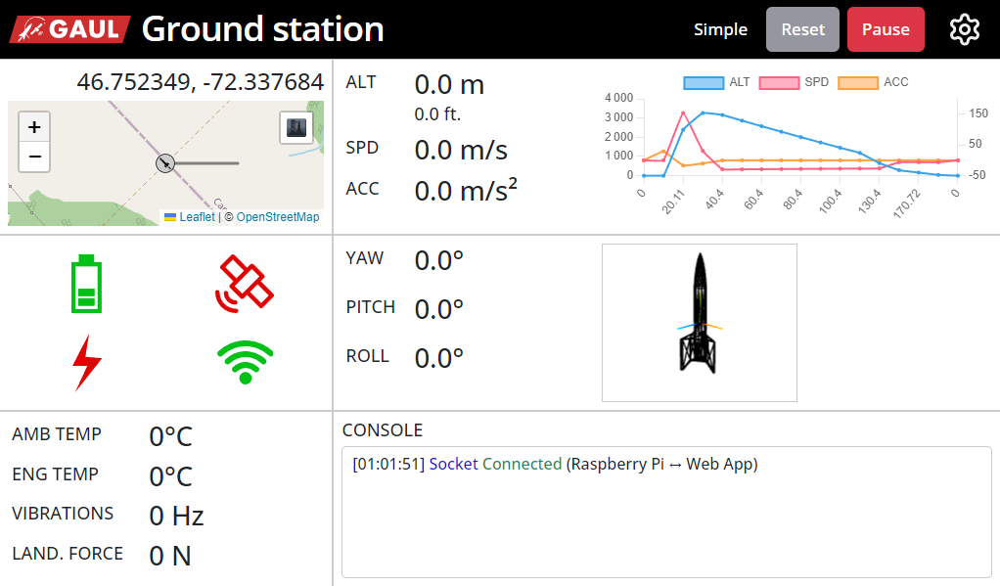

# Station-au-sol

Ce repo contient le code pour la station au sol du GAUL

Le projet fonctionne avec un serveur node.js qui roule sur un Raspberry Pi. Ce serveur reçoit les données de la fusée, puis les envoie aux clients connectés pour mettre à jour leur interface.

[Explications plus détaillées](./doc/explications.md)

## Images de l'interface

[Showcase](doc/showcase/showcase.md)

## Guides

[Guide pour configurer le Raspberry Pi](./doc/raspi-config/raspi-config.md)

[Guide pour développer la station au sol](./doc/guide/developpement.md)

[Guide pour démarrer le mode démo](./doc/guide/demo.md)

---

### [Roadmap](./ROADMAP.md)
