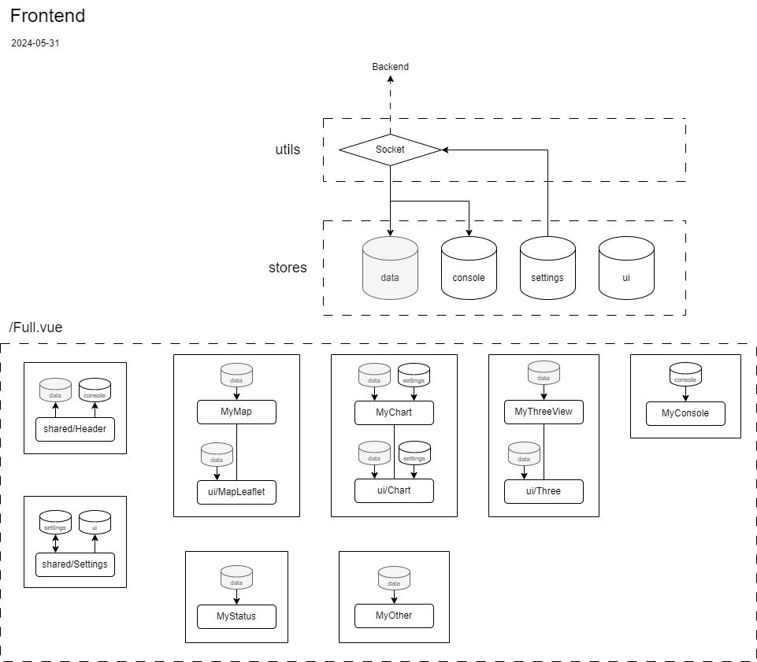

# Station au sol

La station au sol peut être séparé en sa partie software et sa partie hardware. Le software suit une architecture client-serveur,

## Backend

Node.js

Principalement serialport pour communiquer avec l'antenne (RFD900X) et recevoir les données de la fusée.

Express.js pour servir l'interface aux clients par HTTP.

Socket.io pour envoyer les données reçues par la stations aux clients.

## Frontend

Vue.js

L'interface est séparé en components.

Leaflet est utilisé pour la carte.

Three pour afficher la fusée en 3d.

Chart.js pour afficher l'altitude, la vitesse et l'accélération sur un graphique.

Socket.io pour recevoir les données de la station au sol.

Les components ont accès aux données via des data store géré par pinia.

Le store `data` stocke principalement les `n` dernières données reçues.

Le store `console` stocke les messages à afficher dans la console et quelques méthodes pour intéragir avec la console.

Le store `settings` stocke les paramètres de l'interface et les méthodes pour les modifier. Il est donc principalement utilisé par le composant du même nom.

Le store `ui` stocke les états de l'interface, ainsi que les méthodes pour modifier ces états.

## Hardware

Vue normale du modèle 3d de la station au sol disponible sur onshape.

Vue éclaté du modèle 3d de la station au sol disponible sur onshape.

Les modèles des pièces imprimées en 3d sont disponible dans le dossier `step`.

La dernière version du modèle se trouve sur le onshape du GAUL.
