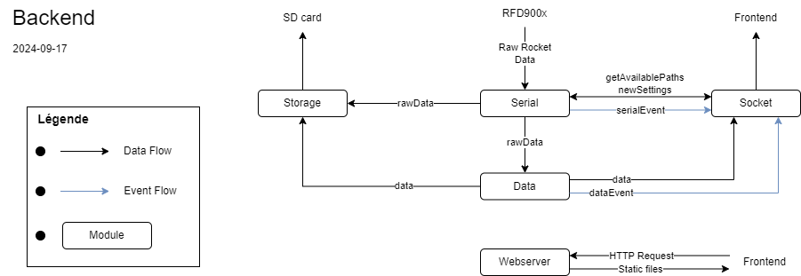
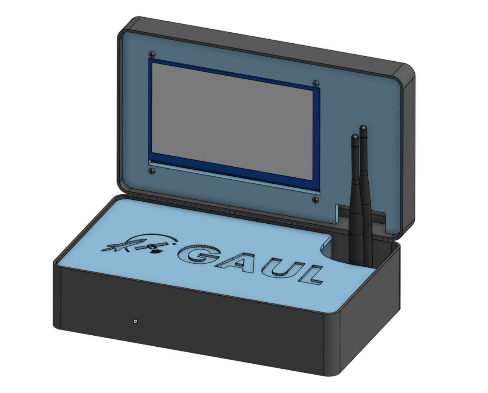
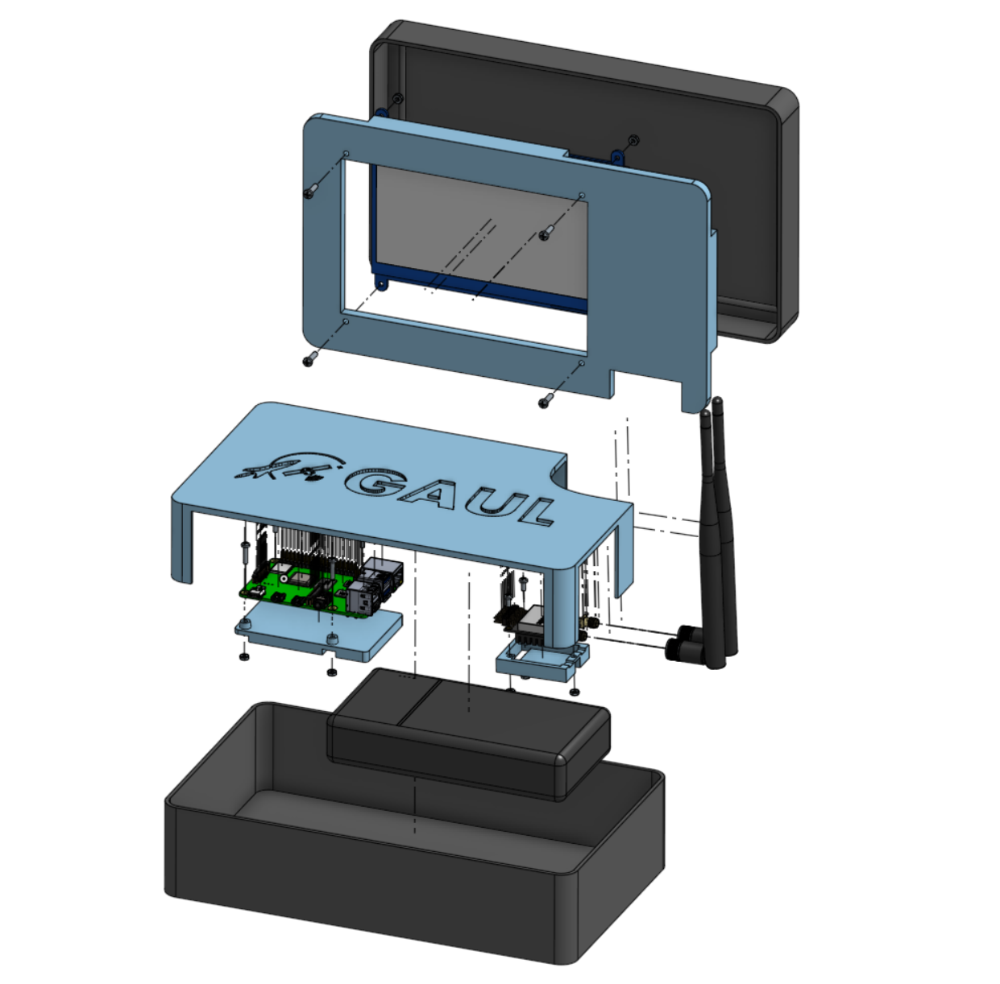
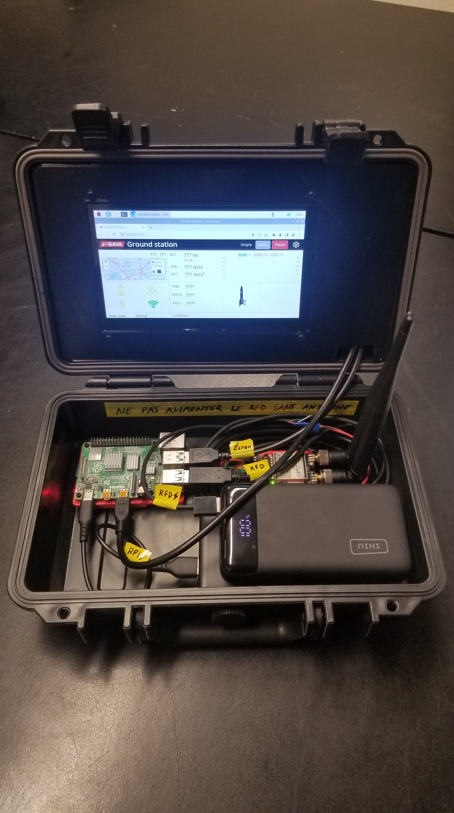
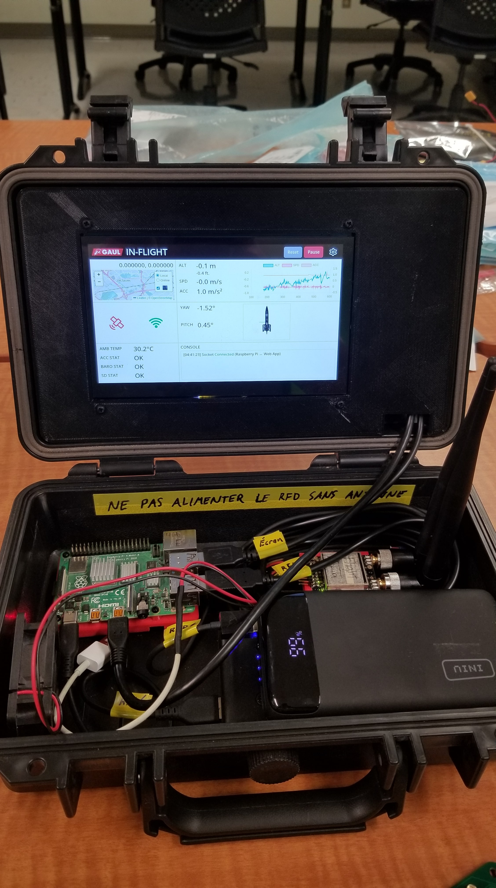
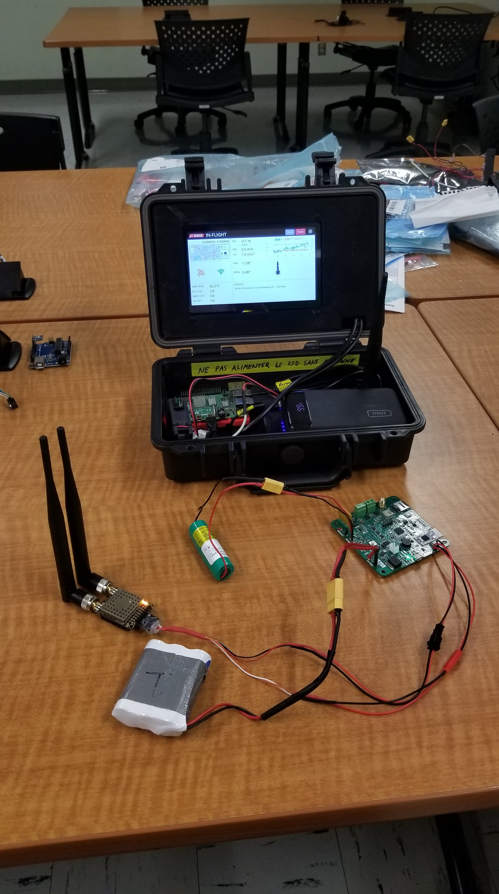
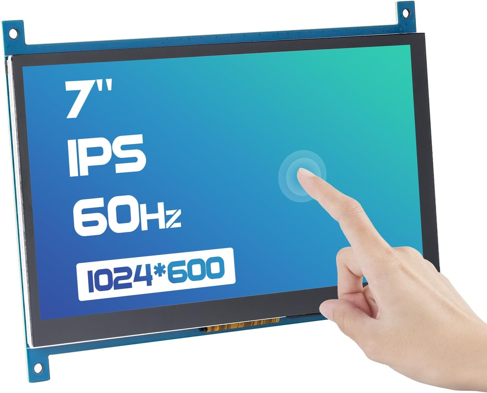
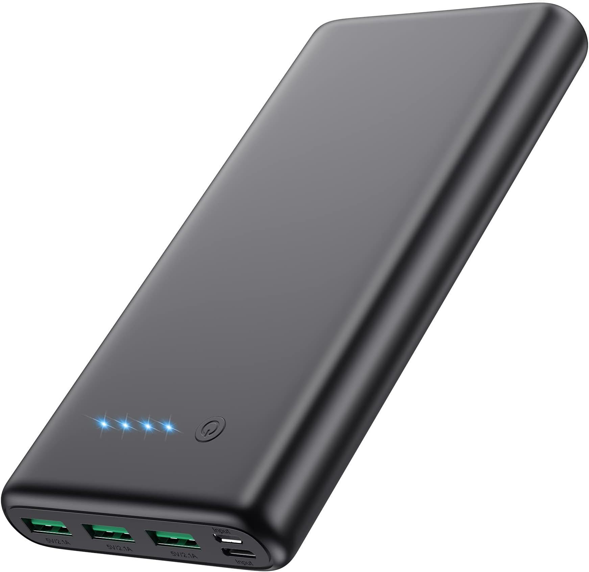
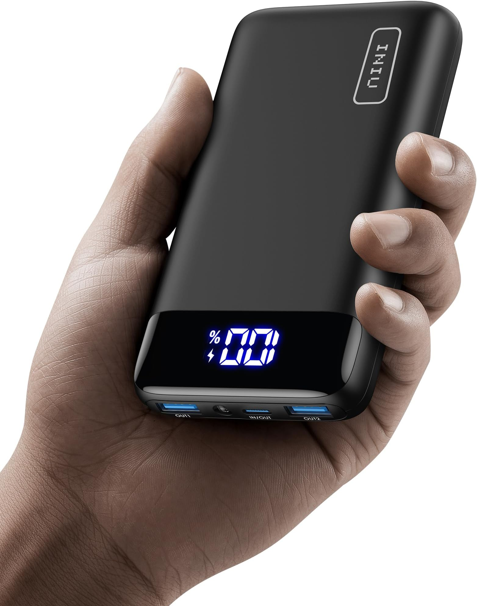
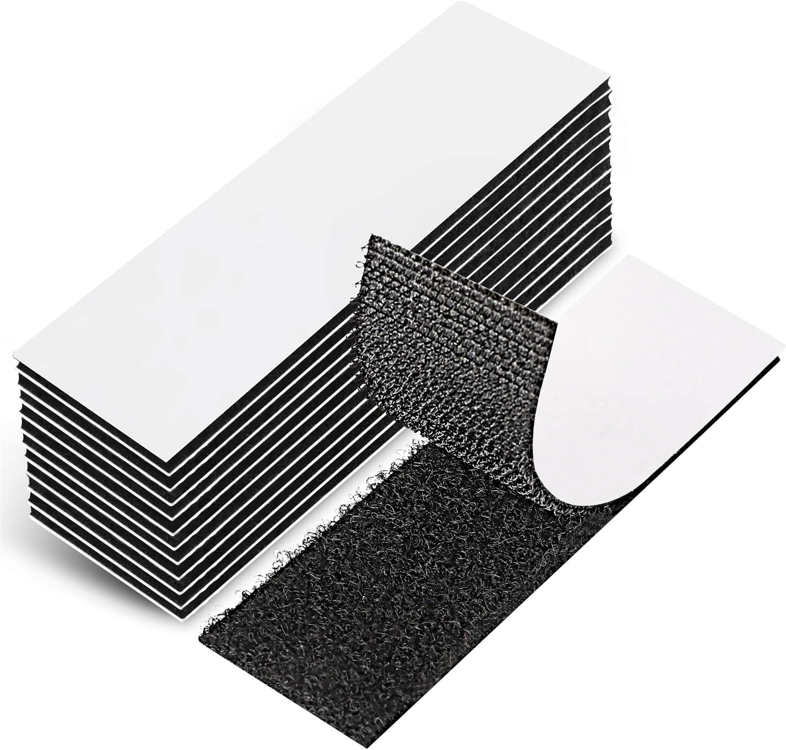

# Station au sol

La station au sol peut être séparée en sa partie logiciel et sa partie physique. Le logiciel suit une architecture client-serveur.

## Backend du logiciel

 

Le serveur en backend utilise [_node.js_](https://nodejs.org/) pour exécuter du code JavaScript directement sur le Raspberry Pi de la station au sol.

Le paradigme de programmation évènementielle est abondamment utilisé dans le backend de la station au sol pour faciliter la gestion des flux de données asynchrones à travers les différents modules.

Le code est séparé en plusieurs modules qui ont des rôles spécifiques et distincts :

-   `server.mjs` : Point d'entrée; initialise les modules du backend, puis s'occupe de transférer les données de vol et les events entre les différents modules.

-   `src/webserver.mjs` : Utilise le framework [_Express.js_](https://expressjs.com/) pour fournir les fichiers statiques aux clients quand ils font une requête à l'adresse `http://gaul-sas.local:8080`.

-   `src/storage.mjs` : Utilise l'[_API de node.js_](https://nodejs.org/api/fs.html#file-system) pour créer des fichiers journaux (log files) contenant les erreurs rencontrées et les données de vol de la fusée.

-   `src/socket.mjs` : Utilise le framwork [_socket.io_](https://socket.io/docs/v4/server-api/) pour communiquer de manière bidirectionnelle avec les clients connectés. Principalement utilisé pour envoyer les erreurs et les données de vol aux clients en temps réel.

-   `src/serial.mjs` : Utilise le framwork [_Node SerialPort_](https://serialport.io/) pour recevoir les données brutes provenant de la fusée. Le Raspberry Pi reçoit les données du module d'antenne [RFD900x](https://rfdesign.com.au/modems/) par [communication serial](https://learn.sparkfun.com/tutorials/serial-communication/all).

-   `src/data.mjs` : Module qui nettoie, formate et standardise les données brutes provenant de la fusée.

Voici un diagramme qui résume les flux de données entre les différents modules :

## Frontend du logiciel

&nbsp;&nbsp;&nbsp;&nbsp;&nbsp; 

Le frontend de la station au sol utilise le framework JavaScript [_Vue.js_](https://vuejs.org/) pour construire une interface web et le framework associé [_Pinia_](https://pinia.vuejs.org/) pour la gestion des états et des données dans des magasins (stores).

Le frontend a une structure séparée en plusieurs dossiers avec des rôles importants à comprendre :

-   `public` : Ressources statiques qui sont disponibles en tout temps à la racine du site. Contiens entre autres les tuiles pour l'affichage de la carte hors ligne.

-   `src/assets` : Les images vectorielles utilisées dans les composants et les fichiers de style [_SCSS_](https://sass-lang.com/documentation/syntax/).

-   `src/components` : Composants de l'interface (voir [composant Vue.js](https://fr.vuejs.org/guide/introduction#single-file-components)). Permets de mieux structurer le code et de réutiliser des composants (par exemple le header et les settings).

-   `src/utils` : Petits fichiers de fonctions JavaScript utiles ailleurs dans le code. Notamment `socket.js` qui gère la connexion au backend via la librairie [_socket.io_](https://socket.io/docs/v4/client-api/).

-   `src/stores` : Magasins du framework [_Pinia_](https://pinia.vuejs.org/) qui gèrent l'état des composants et les données de l'interface (voir la [page d'introduction](https://pinia.vuejs.org/introduction.html)).

-   `src/views` : Les pages de l'interface qui contiennent des composants (voir [Vue Router](https://router.vuejs.org/guide/)).

**Notes importantes :**

-   Les styles individuels des composants se trouvent dans la balise `<style>` des fichiers `.vue`, alors que les styles globaux pour l'interface se trouvent dans les fichiers de styles _SCSS_ du dossier `assets`.

-   Les composants et les magasins (store) pinia utilisent la [Composition API](https://fr.vuejs.org/guide/introduction.html#api-styles) pour sa flexibilité et l'organisation de la logique. Plusieurs exemples de code en ligne utilisent l'Option API, il faut donc faire la traduction entre les deux styles d'API.

Voici les **principaux composants** de l'interface :

-   `MyChart` : Composant qui affiche les valeurs d'altitude, de vitesse et d'accélération, ainsi qu'un graphique pour visualiser l'évolution de ces trois valeurs.

-   `ui/Chart` : Graphique pour le composant `MyChart` qui utilise la librairie [_Chart.js_](https://www.chartjs.org/).

-   `ui/ChartConfig` : Configuration pour le graphique `Chart`.

-   `MyConsole` : Composant qui affiche les évènements et les erreurs de la station au sol.

-   `MyMap` : Composant qui affiche la latitude et la longitude de la fusée, ainsi qu'une carte interactive.

-   `ui/MapLeaflet` : Carte interactive pour le composant `MyMap` qui utilise la librairie [_Leaflet_](https://leafletjs.com/). Affiche la position actuelle et le trajet parcouru de la fusée, ainsi que l'emplacement des rampes de lancement pour Spaceport America Cup et Launch Canada.

-   `MyOther` : Composant qui affiche d'autres valeurs pertinentes provenant de la fusée.

-   `MyStatus` : Composant qui affiche l'état des différentes composantes de la fusée sous forme d'image qui change de couleur.

-   `MyThreeView` : Composant qui affiche les valeurs d'angle de la fusée et un modèle 3D de la fusée qui bouge selon ces valeurs.

-   `ui/Three.vue` : Affichage de la fusée en 3D en utilisant la librairie [_three.js_](https://threejs.org/)

-   `shared/Header` : Header de l'interface à réutiliser sur les différentes pages.

-   `shared/Settings` : Popup pour modifier les paramètres de l'interface et de la station au sol.

Voici les **principaux magasins** (store) gérés par pinia :

-   `data` : Stocke principalement les X dernières données reçues de la fusée. Reçois les données de vol du backend en utilisant la librairie [_socket.io_](https://socket.io/docs/v4/client-api/).

-   `console` : Stocke les messages à afficher dans la console et quelques méthodes pour interagir avec la console. Il est donc principalement utilisé par le composant `Console`.

-   `settings` : Stocke les paramètres de l'interface et les méthodes pour les modifier. Il est donc principalement utilisé par le composant `Settings`.

-   `ui` : Stocke les états de l'interface, ainsi que les méthodes pour modifier ces états.

Voici un diagramme qui résume les flux de données, les liens entre les composants, ainsi que les liens entre les magasins de données (store) et les composants :

## Physique

Vue normale du modèle 3D de la station au sol disponible sur le [onshape du GAUL](https://gaulfsg.onshape.com/documents).

Vue éclaté du modèle 3D de la station au sol disponible sur [le onshape du GAUL](https://gaulfsg.onshape.com/documents).

 

Information utile :

-   La mallette contenant la station au sol, l'écran tactile et les batteries ont été achetés sur Amazon.

-   Des supports pour l'écran, le Raspberry Pi 4B et le RFD900x (antenne) ont ensuite été conçus et imprimés avec une imprimante 3D.

-   Tout a été fixé avec des vis et des bandes de velcro pour garder une modularité des composants.

-   Les modèles des pièces imprimées en 3D sont disponibles dans le dossier `step`.

-   La dernière version du modèle se trouve sur le [onshape du GAUL](https://gaulfsg.onshape.com/documents).

-   Un ventilateur a été ajouté pour s'assurer que le Raspberry Pi 4B ne surchauffe pas.

Voici à quoi ressemble la station au sol en date du 08-2024 :

&nbsp;&nbsp;&nbsp;&nbsp;&nbsp;&nbsp;&nbsp;&nbsp; 

### Références pour les pièces Amazon:

**Mallette style Pelican case:** \
Mayouko Portable Tool Box with Shock- Proof Sponge, Water Proof Grade IP67, Waterproof Hard Case with Foam Insert, Shockproof Carrying Case, Explosion Proof Box, 11.6 inch x 8.3 inch x 3.9 inch (https://a.co/d/38A1IkM)

 

**Écran tactile:** \
SunFounder 7 Inch HDMI 1024×600 USB IPS LCD Touchscreen Display Monitor for Raspberry Pi 5 400 4 3 Model B, 2 Model B, and 1 Model B+, Windows Capacitive Touch Screen (https://a.co/d/ih0YAgL)

 

**Batteries:** \
Portable Charger 36800mAh,4 Outputs Power Bank, Dual Input 5V/3A External Battery Pack,USB-C in&Out High-Speed Charging Backup Charger Compatible with iPhone 15/14/13,Samsung S23 Android Phone etc (https://a.co/d/5cQlJPz)

 

INIU Power Bank, 20000mAh Portable Charger USB C in&out, 22.5W PD3.0 QC4.0 Fast Charge External Battery Pack, LED Display Phone Charger for iPhone 15 14 13 12 Pro X 8 Samsung S22 Google LG iPad Tablet (https://a.co/d/h5Kwnph)

 

**Velcro:** \
EOTW 18 Pack Hook Loop Tape Heavy Duty, 1" x 4" Strong Tape Double Sided Adhesive Sticky Reusable Hook and Loop Interlocking Mounting Tape (https://a.co/d/1i7lMyj)

---

Retour à la [page principale](../README.md)
